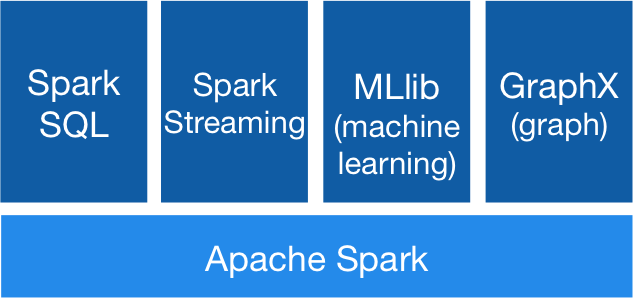
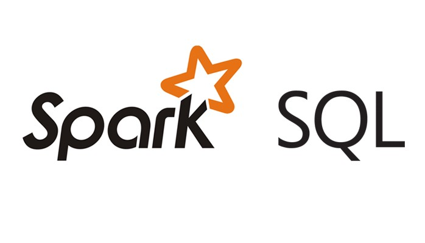
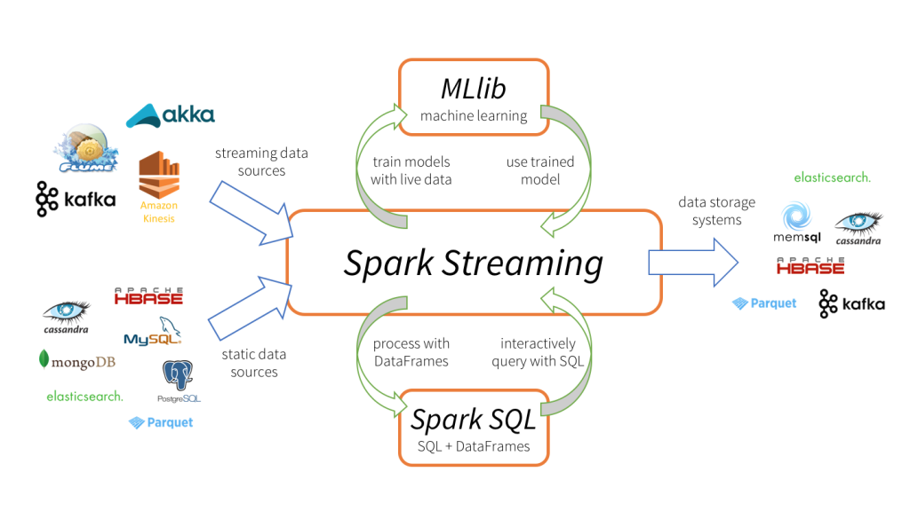

## Apache Spark
June 13, 2020

### What is Spark?
Spark is the cluster computing framework for large-scale data processing. Spark offers a set of libraries in three languages (Java, Scala, Python) for its unified computing engine.

-   Unified — with Spark, there is no need to piece together an application out of multiple APIs or systems. Spark provides you with enough built-in APIs to get the job done.

-   Computing Engine — Spark handles the loading of data from various file systems and runs computations on it, but does not store any data itself permanently. Spark operates entirely in memory, allowing unparalleled performance and speed.

-   Libraries — Spark is comprised of a series of libraries built for data science tasks. Spark includes libraries for SQL (Spark SQL), Machine Learning (MLlib), Stream Processing (Spark Streaming and Structured Streaming), and Graph Analytics (GraphX)

### Why Spark?
A decade ago when Hadoop was released it was big success and could handle the data requirements of those times. But since the coming of streaming we need something more powerful, something that can give us real time data processing which is much faster because the amount of data has grown immensly.

#### Batch Processing
One of the most important topics to understand before diving into spark, is batch processing. This is one of the reasons why Spark came into action.

- Large group of data is processed in a single run.

- Jobs run without any manual intervention.

- The entire data is pre-selected and fed using command-line parameters and scripts.

- It is used to execute multiple organizations, handle heavy data.

What we needed to counter this was Real time Processing which has the following features :

- Data processing takes place upon data entry.

- It must execute on response time withing stringent constraints.

#### Drawbacks of MapReduce

- Unsuitable for real time processing.
- Since it is based on the concept of batch processing it takes minutes to execute jobs depending on the amount of data and number of nodes in the cluster.

- Unsuitable for trivial operations.
- For operations such as filter and join we might need to rewrite the jobs which becomes complex because of the key-value pattern.

- Unfit for large data on network
- It takes a lot of time to copy the data hence takes a lot of bandwidth.

- Unsuitable for OLTP (Online transaction processing)
- OLTP requires large number of short transactions, as it works on the batch framework.

- Unfit for processing Graphs
- Graphs can be processed but relies on external module that runs over hadoop and increases complexity.

- Unfit for Iterative execution
- Being a state-less execution, MapReduce always starts from the beginning. Hence unfit for ML operations.

### Spark Architecture

Before we dive into the spark architecture lets look into some core concepts.

#### RDD
This is the fundamental data structure of spark. It is an immutable distributed collection of objects. Each dataset in RDD is divided into logical partitions, which maybe computed on different nodes of the cluster. In big data, data is divided into clusters hence the data we need to run computations on is reference by the RDD.

Operations supported by RDD:

1. Transformation: transforming your data from one dataset to another dataset.

2. Actions: applying a computation on the transformed data.

Furthermore the term resilient means that the can recompute themselves using the prior data in the lineage.

Lets now move onto the Spark Architecture.

#### Spark SQL

Its a framework that sits on top of spark engine. It brings native supprt for SQL to Spark and streamlines the process of querying data stored both in RDDs and in external sources.

Can work on both structured and unstructered datasets.

-   Structured datasets: Datasets that are in table format hence have a heading assinged to the columns. Could be data in hadoop hive or any csv file.

-   Unstructured datasets: Datasets which are raw and dont have a heading for the columns. eg: JSON data or Parquet files.

#### Spark Streaming

Spark Streaming is an extension of the core Spark API that enables scalable, high-throughput, fault-tolerant stream processing of live data streams.

Internally, it works as follows. Spark Streaming receives live input data streams and divides the data into batches, which are then processed by the Spark engine to generate the final stream of results in batches.

#### MLlib

The ml library for performing machine learning algorithms over spark. It is nine time faster than hadoop disk based version of Apache Mahout.

Some concepts:

1. ML Dataset: SparkML uses the SchemaRDD from Spark SQL as a dataset which can hold a variety of data types.

2. Transformer: A transfomer is an algorithm which can transform one SchemaRDD into another SchemaRDD. Eg. an ML model is a tranformer which transforms an RDD with features into an RDD with predictions.

3. Estimator: An Estimator is an algorithm which can be fit on a SchemaRDD to produce a Transformer. E.g., a learning algorithm is an Estimator which trains on a dataset and produces a model.

4. Pipeline: A Pipeline chains multiple Transformers and Estimators together to specify an ML workflow.

5. Param: All Transformers and Estimators now share a common API for specifying parameters.

#### GraphX

GraphX is Apache Spark’s API for graphs and graph-parallel computation. GraphX unifies ETL (Extract, Transform & Load) process, exploratory analysis and iterative graph computation within a single system. Graphs are used everywhere these days, facebook, google maps, linkedin, you name it.

The following are the features of Spark GraphX:

-   Flexibility: Spark GraphX works with both graphs and computations. GraphX unifies ETL (Extract, Transform & Load), exploratory analysis and iterative graph computation within a single system. We can view the same data as both graphs and collections, transform and join graphs with RDDs efficiently and write custom iterative graph algorithms using the Pregel API.

-   Speed: Spark GraphX provides comparable performance to the fastest specialized graph processing systems. It is comparable with the fastest graph systems while retaining Spark’s flexibility, fault tolerance and ease of use.

-   Growing Algorithm Library: We can choose from a growing library of graph algorithms that Spark GraphX has to offer. Some of the popular algorithms are page rank, connected components, label propagation, SVD++, strongly connected components and triangle count.